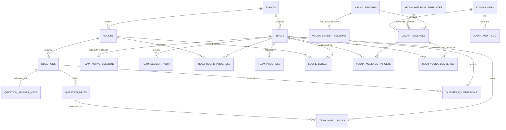

# Stranger Things College Event — Backend, TiDB Database, and Socket.IO Specification

**Status:** Requirements and technical design draft  
**Database:** TiDB Cloud Starter (MySQL-compatible)  
**Realtime:** Socket.IO 4.x  
**Proposed backend runtime:** Node.js + TypeScript + Express + `mysql2/promise` + Socket.IO  
**Expected event:** 7 hours, approximately 70–90 Hawkins teams, multiple Vecna sender teams, approximately 3–5 administrators  
**Cost constraint:** Use free-tier services; verify quotas and hosting behavior before the event.

> Confirmed Vecna workflow: Vecna teams have separate credentials; they can submit a custom message or choose a prepared template; message body is limited to 150 characters; a message may target all Hawkins teams or selected Hawkins teams; every submitted message requires admin approval before it is delivered. Vecna messages are manual, not automatically triggered.

---

## 1. Project objective

Build a secure, persistent backend for a Stranger Things-themed college event. Teams sign in with credentials created by the club, progress through sequential rounds, view questions, request hints, submit each answer once, receive a correct/wrong result, and earn a server-calculated score. The system preserves progress across refreshes, accidental browser closure, and logout/relogin. Administrators manage the event, inspect team progress and submissions, and can force a team's current session to end. Multiple authorized Vecna teams manually submit messages for Hawkins teams; an administrator must approve each message before the backend persists recipient deliveries and Socket.IO delivers it in real time. Vecna messages are not automatically triggered.

The backend must remain authoritative. A participant must not be able to award points to themselves, submit twice, impersonate another team, access a locked round through a manually constructed request, or retrieve correct answers through browser tools.

## 2. Requirements already confirmed

- Approximately 60–90 teams are expected; design for 90 active teams.
- The event lasts approximately 7 hours.
- There are multiple rounds; rounds unlock sequentially.
- Questions are prepared before the event.
- Different questions may carry different marks.
- No event, round, or question timer is required.
- A submitted question is locked permanently.
- A wrong answer earns zero marks and is not retryable.
- Answers are checked server-side.
- Leading/trailing whitespace and capitalization differences should not make otherwise identical answers different. The intended default normalization is `trim + case-insensitive comparison`; internal whitespace and punctuation should not be altered unless the organizer later specifies otherwise.
- Hints are configured per question; some questions may have multiple hints. Hint text, number of hints, and deductions will be supplied later.
- Hint use must be persisted and must not be reusable to avoid a deduction.
- A hint deduction still applies even if the team later submits a wrong answer.
- Teams can revisit earlier questions/rounds that they have already unlocked, but cannot skip unanswered questions to move forward.
- Teams cannot change passwords themselves. The club creates the accounts before the event.
- A team has only one active login/session at a time. A second device should be told that the team is already logged in elsewhere.
- There is no inactivity-based auto-logout.
- If an administrator force-logs out a team, that active session is invalidated and the current browser becomes logged out.
- Administrators can start, pause, resume, and end the event; close login; and stop submissions globally.
- There are 3–5 administrators, all with the same permissions.
- Administrators can see teams, progress, scores, submitted answers, and submission timestamps; search/filter/sort teams; and force-logout a team.
- Administrators cannot manually alter scores, reset progress, reset submissions, or reset/change team passwords.
- The results need overall scores and round-wise scores.
- Vecna messages are sent manually by one or more authorized Vecna teams; do not automatically send messages based on round/question/hint triggers.
- Every Vecna team has a separate account and credentials, distinct from Hawkins team accounts and admin accounts.
- A Vecna sender can target all Hawkins teams or a selected list of Hawkins teams.
- A Vecna sender can type a custom message or select a message template prepared before the event.
- The message body has a strict maximum of 150 characters. Enforce this in both frontend validation and backend validation; the backend is authoritative.
- Every message—custom or template-based—starts in `pending_approval` and must be approved by an administrator before any Hawkins team receives it.
- Administrators can approve or reject submitted messages. Record the reviewer, decision time, and rejection reason if rejected.
- No message is emitted to a Hawkins team room and no team inbox delivery is created until approval succeeds.
- After approval, the message is persisted, per-team deliveries are created, and Socket.IO notifies online recipients. Reconnecting teams can fetch any missed approved messages.
- Prepared templates are stored separately and managed before/during the event through admin-authorized setup or template-management operations. The exact rule for whether Vecna teams can see one another's sent-message history remains unresolved.
- TiDB and Socket.IO are required technologies.
- Free-tier infrastructure is required.

## 3. Question delivery decision: render in the frontend, fetch authorized content from the backend

**Recommended and selected approach:** the frontend owns the question UI, but it requests question content from the backend only when the team is allowed to see it. Do not hard-code every round's question text into public JavaScript or download all rounds at login.

The frontend displays the prompt, permitted media, answer field, and hint controls. The backend returns only the current question or questions in rounds already unlocked for that team. The server stores question content or retrieves it from server-only configuration. Correct answers and validation secrets stay server-side and are never returned to participants.

This approach keeps unreleased prompts out of the initial frontend bundle. Once a prompt is legitimately shown to a participant, they can inspect that currently displayed prompt; the security objective is to protect answer keys, other teams' data, and not-yet-released question content—not to make a visible question impossible to read with DevTools.

---

## 4. Recommended architecture

```text
Browser / Frontend
   | HTTPS requests (login, question fetch, hint use, answer submit, progress)
   | Socket.IO connection (live notices, Vecna messages, forced logout, live updates)
   v
Node.js + TypeScript backend
   ├── REST API (Express)
   ├── Authentication and session service
   ├── Round/progress service
   ├── Answer validation and scoring service
   ├── Hint service
   ├── Admin service
   ├── Vecna sender authorization and message service
   ├── Socket.IO server and room authorization
   ├── Rate limiting / validation / audit logging
   └── mysql2 connection pool (TLS)
          |
          v
      TiDB database
      ├── Team accounts and active sessions
      ├── Event state, rounds, questions and answer-key hashes
      ├── Submissions and hint usage
      ├── Score ledger and round progress
      ├── Vecna sender accounts, sent messages, recipient deliveries
      └── Admin audit + realtime outbox
```

### Responsibilities by component

**Frontend**
- Renders question content returned for an authorized team.
- Sends the answer and question identifier; never sends a score or a claimed `isCorrect` flag.
- Shows the server's result only after the backend confirms the transaction.
- Shows hints only after the backend authorizes/reveals them.
- Restores UI from server state after refresh or reconnect.
- Uses Socket.IO for realtime notifications, not as the only storage mechanism.

**Node backend**
- Authenticates every request and enforces team/admin permissions.
- Decides which rounds/questions are accessible.
- Checks and saves submissions exactly once.
- Computes points and hint deductions server-side.
- Writes related records transactionally.
- Authorizes manually sent Vecna messages, persists per-recipient deliveries, and emits realtime notifications.
- Invalidates sessions on logout/force-logout/event close.

**TiDB**
- Stores durable event data, submissions, sessions, scores, hint use, message deliveries, and audit information.
- Enforces unique constraints that prevent duplicate submissions, duplicate hint uses, and duplicate score entries.
- Is the source of truth after refresh, disconnect, server restart, or logout.

**Socket.IO**
- Pushes server-originated events to the correct team/admin.
- Does not replace database persistence.
- Does not decide scores, answer correctness, or round access.
- Does not let clients choose arbitrary rooms.

---

## 5. Stack recommendation

Use the following unless the existing repository has a strong compatibility reason to differ:

- Node.js LTS
- TypeScript
- Express for REST routes
- Socket.IO 4.x for realtime communication
- `mysql2/promise` for TiDB connectivity
- `zod` (or an equivalent schema library) for request validation
- `argon2` or `bcrypt` for password verification hashes
- Node `crypto` for session-token hashing and HMAC answer checking
- A maintained HTTP rate-limiting package
- A migration tool compatible with MySQL/TiDB, or version-controlled SQL migrations
- Automated tests with Vitest/Jest and Supertest; Socket.IO integration tests where useful

Do not introduce Redis just for the first deployment unless a chosen platform requires multiple backend instances. One Node backend process is the simplest starting point for this event and avoids the extra free-tier dependency. If multiple backend processes are later required, configure a shared Socket.IO adapter and validate deployment/sticky-session requirements.

Use TiDB over TLS. TiDB's official Node.js instructions use the MySQL-compatible `mysql2` driver and require TLS for the public endpoint on TiDB Cloud Starter/Essential. See [TiDB Node.js mysql2 guide](https://docs.pingcap.com/developer/dev-guide-sample-application-nodejs-mysql2/) and [TiDB TLS guide](https://docs.pingcap.com/tidbcloud/secure-connections-to-serverless-clusters/).

---

## 6. Database design principles

1. Use InnoDB tables and `utf8mb4` character encoding.
2. Store application timestamps in UTC and convert to local time only for display.
3. Use parameterized SQL; never interpolate participant-supplied values into SQL.
4. Use foreign keys and explicit constraints where supported by the deployed TiDB version. Validate the migrations against the actual TiDB instance.
5. Use unique constraints as the last line of defense against race conditions.
6. Use short transactions for actions affecting multiple records. Do not hold a transaction open while calling Socket.IO or doing unrelated network work.
7. Keep answer keys out of participant-facing queries and responses.
8. Store scores as a ledger of immutable point changes. Compute totals from the ledger, or maintain a cached summary only if it can be rebuilt from the ledger.
9. Store hint-use penalties at the time the hint is used so changing configuration later cannot rewrite historical scores.
10. Store each accepted submission once. If the client retries after a network timeout, return the existing saved result instead of evaluating or awarding points again.
11. Avoid relying on database triggers, stored procedures, or scheduled database events for game logic. TiDB documentation lists triggers, stored procedures/functions, and events among unsupported MySQL features for the documented compatibility model; run these behaviors in the Node backend instead. See [TiDB MySQL compatibility](https://docs.pingcap.com/tidbcloud/mysql-compatibility/).

---

## 7. Table inventory

The schema below is a recommended baseline. Names can change, but the invariants should remain.

| Table | Purpose | Key invariant |
|---|---|---|
| `events` | One event's lifecycle and global switches | Event state is controlled by admins and checked on every relevant request |
| `teams` | Pre-created team accounts | Username is unique; one row represents one team |
| `admin_users` | Administrator accounts | Only authenticated admins can call admin operations |
| `rounds` | Ordered rounds | Round number is unique within the event |
| `questions` | Question metadata and optionally server-held prompt content | Question order is unique within a round |
| `question_answer_keys` | Server-only accepted answer HMACs | Never exposed to participant queries/APIs |
| `question_hints` | Hint text and penalty values | Hint order is unique within a question |
| `team_active_sessions` | The one current session for each team | `team_id` is the primary key, so two active sessions cannot coexist |
| `team_session_audit` | Login/logout/force-logout history | Never stores raw session tokens or passwords |
| `team_round_progress` | Each team's state for each round | One record per team/round |
| `team_progress` | Last viewed location and high-level progress | One row per team; not a substitute for submissions |
| `question_submissions` | One immutable submission per team/question | Unique `(team_id, question_id)` |
| `team_hint_usages` | Hints consumed by a team | Unique `(team_id, hint_id)` |
| `score_ledger` | Immutable point awards/deductions | One ledger entry per source action |
| `vecna_senders` | Multiple authorized Vecna sender accounts | Each Vecna team has its own credentials; cannot inherit admin permissions |
| `vecna_sender_sessions` | Active sessions for Vecna sender accounts | One active session per Vecna sender account (proposed default; confirm only if needed) |
| `vecna_message_templates` | Prepared messages selectable by Vecna teams | Each active template body is at most 150 characters |
| `vecna_messages` | Manually submitted Vecna message requests and approval status | Body at most 150 characters; no delivery before admin approval |
| `vecna_message_targets` | Team targets selected for a message awaiting review | Only valid Hawkins team IDs; no arbitrary socket rooms |
| `team_vecna_deliveries` | Durable per-team inbox, created only after approval | Unique `(message_id, team_id)` prevents duplicate recipient deliveries |
| `realtime_outbox` | Pending notifications to emit after DB commits | Durable changes can be re-emitted after process failure |
| `admin_audit_log` | Admin control history | Records who performed sensitive actions, without secret values |

An optional `leaderboard_snapshots` table is not required initially; scores for 90 teams can be calculated from the score ledger with suitable indexes. An optional `event_audit_log` can record event state changes; the `admin_audit_log` may cover these too.

---

## 8. Proposed schema (TiDB/MySQL-compatible starter DDL)

**Important:** This DDL is a blueprint, not yet tested against your actual TiDB instance or finalized game rules. Review migrations against the exact TiDB Cloud plan/version before deploying. Use an explicit migration sequence in the repository; do not paste all migrations blindly into production.

### 8.1 `events`

One event row may be enough for this single-event software. Keep `event_id` to allow clean references and future local testing.

```sql
CREATE TABLE events (
  event_id BIGINT UNSIGNED NOT NULL AUTO_INCREMENT,
  event_code VARCHAR(64) NOT NULL,
  event_name VARCHAR(160) NOT NULL,
  status VARCHAR(24) NOT NULL DEFAULT 'draft',
  login_open TINYINT(1) NOT NULL DEFAULT 0,
  submissions_open TINYINT(1) NOT NULL DEFAULT 0,
  is_paused TINYINT(1) NOT NULL DEFAULT 0,
  started_at DATETIME(3) NULL,
  ended_at DATETIME(3) NULL,
  created_at DATETIME(3) NOT NULL DEFAULT CURRENT_TIMESTAMP(3),
  updated_at DATETIME(3) NOT NULL DEFAULT CURRENT_TIMESTAMP(3),
  PRIMARY KEY (event_id),
  UNIQUE KEY uq_events_code (event_code)
) ENGINE=InnoDB DEFAULT CHARSET=utf8mb4 COLLATE=utf8mb4_bin;
```

Rules:
- Event-state changes must be made through one backend service, with state-transition validation.
- `status`, `login_open`, `submissions_open`, and `is_paused` must not be updated independently by arbitrary routes. Use a single service to keep them consistent.
- Starting/pausing/resuming/ending and closing login/stopping submissions are distinct actions. Decide whether `end event` automatically closes login and submissions; recommended behavior is yes, but confirm this in the event policy.

### 8.2 `teams`

```sql
CREATE TABLE teams (
  team_id BIGINT UNSIGNED NOT NULL AUTO_INCREMENT,
  event_id BIGINT UNSIGNED NOT NULL,
  team_code VARCHAR(40) NOT NULL,
  team_name VARCHAR(100) NOT NULL,
  username VARCHAR(80) NOT NULL,
  username_normalized VARCHAR(80) NOT NULL,
  password_hash VARCHAR(255) NOT NULL,
  password_ciphertext TEXT NULL,
  password_nonce VARCHAR(64) NULL,
  password_auth_tag VARCHAR(64) NULL,
  password_key_version VARCHAR(32) NULL,
  is_enabled TINYINT(1) NOT NULL DEFAULT 1,
  created_at DATETIME(3) NOT NULL DEFAULT CURRENT_TIMESTAMP(3),
  updated_at DATETIME(3) NOT NULL DEFAULT CURRENT_TIMESTAMP(3),
  last_login_at DATETIME(3) NULL,
  PRIMARY KEY (team_id),
  UNIQUE KEY uq_teams_event_code (event_id, team_code),
  UNIQUE KEY uq_teams_username (username_normalized),
  CONSTRAINT fk_teams_event FOREIGN KEY (event_id) REFERENCES events(event_id)
) ENGINE=InnoDB DEFAULT CHARSET=utf8mb4 COLLATE=utf8mb4_bin;
```

Notes:
- The club creates these records before the event, ideally via a secure one-time import script.
- Normalize usernames consistently in the backend before lookup. The normalized column prevents case-variant duplicates.
- `password_hash` is used for authentication.
- The encrypted password fields are only needed if the requirement that admins retrieve the existing password remains. Use authenticated encryption such as AES-256-GCM with a key held only in the backend's secret environment. Do not log or casually return it. If admins do not need to read the original password, remove the ciphertext fields and keep only the hash.
- `is_enabled` is for account provisioning, not for a routine administrator “disable team” control. The event UI can omit that action if not allowed.
- Passwords and credentials must never be exported in the results report.

### 8.3 `admin_users`

```sql
CREATE TABLE admin_users (
  admin_id BIGINT UNSIGNED NOT NULL AUTO_INCREMENT,
  username VARCHAR(80) NOT NULL,
  username_normalized VARCHAR(80) NOT NULL,
  password_hash VARCHAR(255) NOT NULL,
  display_name VARCHAR(120) NOT NULL,
  is_active TINYINT(1) NOT NULL DEFAULT 1,
  created_at DATETIME(3) NOT NULL DEFAULT CURRENT_TIMESTAMP(3),
  last_login_at DATETIME(3) NULL,
  PRIMARY KEY (admin_id),
  UNIQUE KEY uq_admin_username (username_normalized)
) ENGINE=InnoDB DEFAULT CHARSET=utf8mb4 COLLATE=utf8mb4_bin;
```

Do not reuse participant sessions for admin authentication. Administrators must authenticate separately. They all have the same authorization level for the agreed event operations.

### 8.4 `rounds`

```sql
CREATE TABLE rounds (
  round_id BIGINT UNSIGNED NOT NULL AUTO_INCREMENT,
  event_id BIGINT UNSIGNED NOT NULL,
  round_number INT UNSIGNED NOT NULL,
  round_code VARCHAR(64) NOT NULL,
  round_name VARCHAR(160) NOT NULL,
  is_active TINYINT(1) NOT NULL DEFAULT 1,
  created_at DATETIME(3) NOT NULL DEFAULT CURRENT_TIMESTAMP(3),
  PRIMARY KEY (round_id),
  UNIQUE KEY uq_round_number (event_id, round_number),
  UNIQUE KEY uq_round_code (event_id, round_code),
  CONSTRAINT fk_rounds_event FOREIGN KEY (event_id) REFERENCES events(event_id)
) ENGINE=InnoDB DEFAULT CHARSET=utf8mb4 COLLATE=utf8mb4_bin;
```

Sequential unlocking is enforced by application logic backed by `team_round_progress`; the `round_number` column gives the intended order.

### 8.5 `questions`

This table stores the server-side question manifest. The question prompt may be stored here or in a related content payload. The frontend should render the question, but not ship all restricted future questions in its public bundle.

```sql
CREATE TABLE questions (
  question_id BIGINT UNSIGNED NOT NULL AUTO_INCREMENT,
  round_id BIGINT UNSIGNED NOT NULL,
  question_code VARCHAR(80) NOT NULL,
  question_order INT UNSIGNED NOT NULL,
  question_type VARCHAR(40) NOT NULL,
  points DECIMAL(8,2) NOT NULL DEFAULT 0,
  prompt_content JSON NULL,
  media_config JSON NULL,
  normalization_profile VARCHAR(40) NOT NULL DEFAULT 'trim_lowercase',
  validator_type VARCHAR(40) NOT NULL DEFAULT 'exact_hmac',
  is_active TINYINT(1) NOT NULL DEFAULT 1,
  created_at DATETIME(3) NOT NULL DEFAULT CURRENT_TIMESTAMP(3),
  updated_at DATETIME(3) NOT NULL DEFAULT CURRENT_TIMESTAMP(3),
  PRIMARY KEY (question_id),
  UNIQUE KEY uq_question_code (question_code),
  UNIQUE KEY uq_question_order (round_id, question_order),
  CONSTRAINT fk_questions_round FOREIGN KEY (round_id) REFERENCES rounds(round_id)
) ENGINE=InnoDB DEFAULT CHARSET=utf8mb4 COLLATE=utf8mb4_bin;
```

Rules:
- `question_code` is a stable identifier used to connect the frontend display to a server question record. Do not trust it alone; validate access in the backend.
- `prompt_content` can hold text or structured content if the server serves question prompts. If prompts are hosted in a server-side file, keep a content key/path here instead and never return unrestricted file paths.
- `media_config` can describe allowed media references. Use public-safe media URLs only where appropriate; do not put answer keys in media metadata.
- `points` is a configuration value. Actual awarded points are saved in the score ledger at the moment of a successful correct submission.
- The exact `question_type` values and supported validators are unresolved and must be agreed before building question-specific validation logic.

### 8.6 `question_answer_keys`

Store accepted answers as keyed hashes instead of plain answers when using exact-match validation. The server computes an HMAC from the normalized submitted answer using an `ANSWER_HMAC_SECRET` held in the backend environment. Never send this secret to the browser.

```sql
CREATE TABLE question_answer_keys (
  answer_key_id BIGINT UNSIGNED NOT NULL AUTO_INCREMENT,
  question_id BIGINT UNSIGNED NOT NULL,
  accepted_answer_hmac CHAR(64) NOT NULL,
  answer_variant_number INT UNSIGNED NOT NULL DEFAULT 1,
  is_active TINYINT(1) NOT NULL DEFAULT 1,
  created_at DATETIME(3) NOT NULL DEFAULT CURRENT_TIMESTAMP(3),
  PRIMARY KEY (answer_key_id),
  UNIQUE KEY uq_question_answer_variant (question_id, answer_variant_number),
  UNIQUE KEY uq_question_answer_hmac (question_id, accepted_answer_hmac),
  CONSTRAINT fk_answer_keys_question FOREIGN KEY (question_id) REFERENCES questions(question_id)
) ENGINE=InnoDB DEFAULT CHARSET=utf8mb4 COLLATE=utf8mb4_bin;
```

Rules:
- A seed/import script normalizes the intended correct answer and computes its HMAC before inserting it.
- If a question accepts more than one answer, add a row for each accepted variant.
- A plain unsalted hash of a short answer is not sufficient protection against dictionary guessing. Use HMAC with a server-only secret or an authenticated-encryption design.
- `HMAC(secret, normalized_answer)` is only appropriate for question types supported by exact normalized-string comparison. Special types such as MCQs should use stable option IDs, and numeric/code questions may need their own explicitly designed normalization/validator.
- The backend should compare candidate HMACs in constant time where practical.
- Correct answers must not be returned by question-fetch, submission, progress, leaderboard, or Socket.IO payloads.

### 8.7 `question_hints`

```sql
CREATE TABLE question_hints (
  hint_id BIGINT UNSIGNED NOT NULL AUTO_INCREMENT,
  question_id BIGINT UNSIGNED NOT NULL,
  hint_order INT UNSIGNED NOT NULL,
  hint_text TEXT NOT NULL,
  penalty_points DECIMAL(8,2) NOT NULL DEFAULT 0,
  is_active TINYINT(1) NOT NULL DEFAULT 1,
  PRIMARY KEY (hint_id),
  UNIQUE KEY uq_question_hint_order (question_id, hint_order),
  CONSTRAINT fk_hints_question FOREIGN KEY (question_id) REFERENCES questions(question_id)
) ENGINE=InnoDB DEFAULT CHARSET=utf8mb4 COLLATE=utf8mb4_bin;
```

Hint text and penalty can vary by question and by hint. The actual rows will be populated when organizers finalize hints. The backend must not reveal all hints in the initial question response; it should return a hint only after the associated hint-use transaction succeeds.

### 8.8 `team_active_sessions`

This table is the key one-session-per-team enforcement mechanism. There is exactly one possible active-session row per team because `team_id` is the primary key.

```sql
CREATE TABLE team_active_sessions (
  team_id BIGINT UNSIGNED NOT NULL,
  session_id CHAR(36) NOT NULL,
  session_token_hash CHAR(64) NOT NULL,
  created_at DATETIME(3) NOT NULL DEFAULT CURRENT_TIMESTAMP(3),
  last_seen_at DATETIME(3) NOT NULL DEFAULT CURRENT_TIMESTAMP(3),
  valid_until DATETIME(3) NULL,
  PRIMARY KEY (team_id),
  UNIQUE KEY uq_active_session_id (session_id),
  UNIQUE KEY uq_active_session_token_hash (session_token_hash),
  CONSTRAINT fk_active_session_team FOREIGN KEY (team_id) REFERENCES teams(team_id)
) ENGINE=InnoDB DEFAULT CHARSET=utf8mb4 COLLATE=utf8mb4_bin;
```

Operational rules:
- Generate a cryptographically random opaque session token. Send the raw token only in a secure, HTTP-only cookie; store only its hash in TiDB.
- On login, attempt to insert the active session row. If the team row already exists, reject the second login with the agreed “already logged in somewhere” message. The database's primary key is the race-condition safeguard.
- On logout or forced logout, delete the active session row and record an audit event in the same transaction.
- Validate the token hash against an active row on every protected HTTP request. Do not use only an in-memory session object.
- No inactivity timeout is required. The server should still invalidate sessions when the event login window/event closes, subject to the final event lifecycle rules.
- Cookie flags should be `HttpOnly`, `Secure` in production, and an appropriate `SameSite` value. Avoid storing the session token in localStorage.
- If multiple tabs share the same browser cookie, they technically share the same team session; the policy on multiple tabs is still to be confirmed.

### 8.9 `team_session_audit`

```sql
CREATE TABLE team_session_audit (
  session_audit_id BIGINT UNSIGNED NOT NULL AUTO_INCREMENT,
  team_id BIGINT UNSIGNED NOT NULL,
  session_id CHAR(36) NULL,
  action_type VARCHAR(40) NOT NULL,
  reason VARCHAR(160) NULL,
  actor_admin_id BIGINT UNSIGNED NULL,
  occurred_at DATETIME(3) NOT NULL DEFAULT CURRENT_TIMESTAMP(3),
  PRIMARY KEY (session_audit_id),
  KEY ix_session_audit_team_time (team_id, occurred_at),
  CONSTRAINT fk_session_audit_team FOREIGN KEY (team_id) REFERENCES teams(team_id),
  CONSTRAINT fk_session_audit_admin FOREIGN KEY (actor_admin_id) REFERENCES admin_users(admin_id)
) ENGINE=InnoDB DEFAULT CHARSET=utf8mb4 COLLATE=utf8mb4_bin;
```

Possible actions: `login_success`, `login_blocked_already_active`, `logout`, `admin_force_logout`, `event_closed`. Never store passwords, raw session tokens, or answer keys in this log.

### 8.10 `team_round_progress`

```sql
CREATE TABLE team_round_progress (
  team_id BIGINT UNSIGNED NOT NULL,
  round_id BIGINT UNSIGNED NOT NULL,
  status VARCHAR(24) NOT NULL DEFAULT 'locked',
  unlocked_at DATETIME(3) NULL,
  completed_at DATETIME(3) NULL,
  updated_at DATETIME(3) NOT NULL DEFAULT CURRENT_TIMESTAMP(3),
  PRIMARY KEY (team_id, round_id),
  KEY ix_round_progress_round_status (round_id, status),
  CONSTRAINT fk_round_progress_team FOREIGN KEY (team_id) REFERENCES teams(team_id),
  CONSTRAINT fk_round_progress_round FOREIGN KEY (round_id) REFERENCES rounds(round_id)
) ENGINE=InnoDB DEFAULT CHARSET=utf8mb4 COLLATE=utf8mb4_bin;
```

Use `locked`, `unlocked`, and `completed` (or a documented equivalent). When a team account is provisioned, initialize the first round as unlocked and later rounds as locked. A round completes only when all required questions in that round have one final submission, unless the organizer specifies another rule.

### 8.11 `team_progress`

```sql
CREATE TABLE team_progress (
  team_id BIGINT UNSIGNED NOT NULL,
  current_round_id BIGINT UNSIGNED NULL,
  last_opened_question_id BIGINT UNSIGNED NULL,
  last_progress_at DATETIME(3) NOT NULL DEFAULT CURRENT_TIMESTAMP(3),
  PRIMARY KEY (team_id),
  CONSTRAINT fk_progress_team FOREIGN KEY (team_id) REFERENCES teams(team_id),
  CONSTRAINT fk_progress_round FOREIGN KEY (current_round_id) REFERENCES rounds(round_id),
  CONSTRAINT fk_progress_question FOREIGN KEY (last_opened_question_id) REFERENCES questions(question_id)
) ENGINE=InnoDB DEFAULT CHARSET=utf8mb4 COLLATE=utf8mb4_bin;
```

This supports returning to the last screen/question after refresh/relogin. It does not determine whether a question is accessible; the backend must check round status and submission state every time. Do not allow a client to overwrite another team's progress by passing an arbitrary team ID.

### 8.12 `question_submissions`

```sql
CREATE TABLE question_submissions (
  submission_id BIGINT UNSIGNED NOT NULL AUTO_INCREMENT,
  team_id BIGINT UNSIGNED NOT NULL,
  round_id BIGINT UNSIGNED NOT NULL,
  question_id BIGINT UNSIGNED NOT NULL,
  submitted_answer TEXT NOT NULL,
  is_correct TINYINT(1) NOT NULL,
  points_awarded DECIMAL(8,2) NOT NULL DEFAULT 0,
  submitted_at DATETIME(3) NOT NULL DEFAULT CURRENT_TIMESTAMP(3),
  PRIMARY KEY (submission_id),
  UNIQUE KEY uq_one_submission_per_team_question (team_id, question_id),
  KEY ix_submissions_team_round (team_id, round_id, submitted_at),
  KEY ix_submissions_round_time (round_id, submitted_at),
  CONSTRAINT fk_submissions_team FOREIGN KEY (team_id) REFERENCES teams(team_id),
  CONSTRAINT fk_submissions_round FOREIGN KEY (round_id) REFERENCES rounds(round_id),
  CONSTRAINT fk_submissions_question FOREIGN KEY (question_id) REFERENCES questions(question_id)
) ENGINE=InnoDB DEFAULT CHARSET=utf8mb4 COLLATE=utf8mb4_bin;
```

Rules:
- A wrong submission is saved as `is_correct = 0` and `points_awarded = 0`, then permanently locks the question.
- A correct submission is saved with its server-computed points.
- Unique `(team_id, question_id)` guarantees one accepted submission per question/team.
- The submitted answer is visible only to that team's authorized result view and to authorized admins. Never return other teams' answers.
- If the user retries after a timeout and the row already exists, return the saved result. Do not re-evaluate or award anything a second time.
- The backend derives `team_id` and `round_id` from the authenticated session and server question data; do not trust these values from the request body.

### 8.13 `team_hint_usages`

```sql
CREATE TABLE team_hint_usages (
  hint_usage_id BIGINT UNSIGNED NOT NULL AUTO_INCREMENT,
  team_id BIGINT UNSIGNED NOT NULL,
  question_id BIGINT UNSIGNED NOT NULL,
  hint_id BIGINT UNSIGNED NOT NULL,
  penalty_points DECIMAL(8,2) NOT NULL,
  used_at DATETIME(3) NOT NULL DEFAULT CURRENT_TIMESTAMP(3),
  PRIMARY KEY (hint_usage_id),
  UNIQUE KEY uq_team_hint_once (team_id, hint_id),
  KEY ix_hint_usage_team_question (team_id, question_id),
  CONSTRAINT fk_hint_usage_team FOREIGN KEY (team_id) REFERENCES teams(team_id),
  CONSTRAINT fk_hint_usage_question FOREIGN KEY (question_id) REFERENCES questions(question_id),
  CONSTRAINT fk_hint_usage_hint FOREIGN KEY (hint_id) REFERENCES question_hints(hint_id)
) ENGINE=InnoDB DEFAULT CHARSET=utf8mb4 COLLATE=utf8mb4_bin;
```

Rules:
- A hint can be used only if its question is accessible and not already submitted.
- Insert the usage record and its corresponding score-ledger deduction in the same transaction.
- If the unique constraint reports that the hint was already used, do not apply another deduction.
- Return the hint text only after the transaction confirms its usage.
- `penalty_points` is a snapshot of the configured penalty at usage time.

### 8.14 `score_ledger`

```sql
CREATE TABLE score_ledger (
  score_entry_id BIGINT UNSIGNED NOT NULL AUTO_INCREMENT,
  team_id BIGINT UNSIGNED NOT NULL,
  round_id BIGINT UNSIGNED NOT NULL,
  question_id BIGINT UNSIGNED NULL,
  source_type VARCHAR(32) NOT NULL,
  source_id VARCHAR(80) NOT NULL,
  points_delta DECIMAL(8,2) NOT NULL,
  created_at DATETIME(3) NOT NULL DEFAULT CURRENT_TIMESTAMP(3),
  PRIMARY KEY (score_entry_id),
  UNIQUE KEY uq_score_source (team_id, source_type, source_id),
  KEY ix_score_team_round (team_id, round_id),
  KEY ix_score_round (round_id),
  CONSTRAINT fk_score_team FOREIGN KEY (team_id) REFERENCES teams(team_id),
  CONSTRAINT fk_score_round FOREIGN KEY (round_id) REFERENCES rounds(round_id),
  CONSTRAINT fk_score_question FOREIGN KEY (question_id) REFERENCES questions(question_id)
) ENGINE=InnoDB DEFAULT CHARSET=utf8mb4 COLLATE=utf8mb4_bin;
```

Conventions:
- `source_type = 'correct_answer'`, `source_id = submission_id`, `points_delta = points awarded`.
- `source_type = 'hint_penalty'`, `source_id = hint_usage_id`, `points_delta = negative penalty`.
- A wrong answer adds no answer-points row; its zero-score outcome remains visible in `question_submissions`.
- No admin score adjustment path should exist, per the current requirement.
- Overall score: `SUM(points_delta)` grouped by team.
- Round score: `SUM(points_delta)` grouped by team and round.
- Decide whether a hint penalty can make the question/team total negative or whether scores have a floor of zero. This rule is not yet confirmed. The schema can represent either outcome, but the scoring service must implement one consistent rule once confirmed.

Example overall score query:

```sql
SELECT team_id, COALESCE(SUM(points_delta), 0) AS overall_score
FROM score_ledger
GROUP BY team_id;
```

Example round-wise score query:

```sql
SELECT team_id, round_id, COALESCE(SUM(points_delta), 0) AS round_score
FROM score_ledger
GROUP BY team_id, round_id;
```

### 8.15 `vecna_senders` — multiple manually authorized Vecna teams

The system must support more than one Vecna team. Vecna senders have their own separate credentials, distinct from Hawkins participant accounts and admin accounts.

```sql
CREATE TABLE vecna_senders (
  vecna_sender_id BIGINT UNSIGNED NOT NULL AUTO_INCREMENT,
  sender_code VARCHAR(40) NOT NULL,
  sender_name VARCHAR(100) NOT NULL,
  username VARCHAR(80) NOT NULL,
  username_normalized VARCHAR(80) NOT NULL,
  password_hash VARCHAR(255) NOT NULL,
  is_enabled TINYINT(1) NOT NULL DEFAULT 1,
  created_at DATETIME(3) NOT NULL DEFAULT CURRENT_TIMESTAMP(3),
  updated_at DATETIME(3) NOT NULL DEFAULT CURRENT_TIMESTAMP(3),
  last_login_at DATETIME(3) NULL,
  PRIMARY KEY (vecna_sender_id),
  UNIQUE KEY uq_vecna_sender_code (sender_code),
  UNIQUE KEY uq_vecna_sender_username (username_normalized)
) ENGINE=InnoDB DEFAULT CHARSET=utf8mb4 COLLATE=utf8mb4_bin;
```

- Create multiple sender rows for the multiple Vecna teams.
- Store only password hashes unless the owner explicitly confirms a requirement for retrievable passwords and accepts the associated security trade-off.
- Vecna sender accounts may send messages but must not automatically receive admin permissions.
- Every sent message must record which Vecna sender sent it.

### 8.16 `vecna_sender_sessions`

Vecna teams use separate accounts, so this table stores their active sessions independently from Hawkins team sessions and admin sessions.

```sql
CREATE TABLE vecna_sender_sessions (
  vecna_sender_id BIGINT UNSIGNED NOT NULL,
  session_id CHAR(36) NOT NULL,
  session_token_hash CHAR(64) NOT NULL,
  created_at DATETIME(3) NOT NULL DEFAULT CURRENT_TIMESTAMP(3),
  last_seen_at DATETIME(3) NOT NULL DEFAULT CURRENT_TIMESTAMP(3),
  expires_at DATETIME(3) NOT NULL,
  revoked_at DATETIME(3) NULL,
  PRIMARY KEY (vecna_sender_id),
  UNIQUE KEY uq_vecna_sender_session_id (session_id),
  UNIQUE KEY uq_vecna_sender_token_hash (session_token_hash),
  CONSTRAINT fk_vecna_sender_session_sender FOREIGN KEY (vecna_sender_id) REFERENCES vecna_senders(vecna_sender_id)
) ENGINE=InnoDB DEFAULT CHARSET=utf8mb4 COLLATE=utf8mb4_bin;
```

The primary key supports one active session per Vecna sender account. Use distinct accounts and permissions; never share raw credentials in code. If the organizer later decides Vecna teams may use multiple concurrent devices, this constraint can be revisited explicitly.

### 8.17 `vecna_message_templates` — prepared messages

Stores prepared message templates a Vecna sender may choose instead of typing a custom message. Templates must be configured before they are offered in the sender UI. The API for managing templates is admin-only. Selecting a template does **not** bypass approval: the selected text is copied into a new `vecna_messages` request and still awaits an admin decision.

```sql
CREATE TABLE vecna_message_templates (
  template_id BIGINT UNSIGNED NOT NULL AUTO_INCREMENT,
  template_code VARCHAR(64) NOT NULL,
  template_name VARCHAR(100) NOT NULL,
  body_text VARCHAR(150) NOT NULL,
  is_active TINYINT(1) NOT NULL DEFAULT 1,
  created_by_admin_id BIGINT UNSIGNED NOT NULL,
  created_at DATETIME(3) NOT NULL DEFAULT CURRENT_TIMESTAMP(3),
  updated_at DATETIME(3) NOT NULL DEFAULT CURRENT_TIMESTAMP(3),
  PRIMARY KEY (template_id),
  UNIQUE KEY uq_vecna_template_code (template_code),
  KEY ix_vecna_templates_active (is_active, template_name),
  CONSTRAINT fk_vecna_template_admin FOREIGN KEY (created_by_admin_id) REFERENCES admin_users(admin_id)
) ENGINE=InnoDB DEFAULT CHARSET=utf8mb4 COLLATE=utf8mb4_bin;
```

Validation rules:
- `body_text` must contain 1–150 characters after the agreed trimming policy.
- The backend must enforce the length limit; frontend validation is only for convenience.
- Templates should be deactivated rather than deleted once referenced by historical messages.
- Store a copy/snapshot of the selected template text in `vecna_messages.body_text`, so editing a template later does not change a previously submitted or approved message.

### 8.18 `vecna_messages` — submitted message and approval lifecycle

A row is created when a Vecna sender submits a custom message or chooses a prepared template. It is **not delivered at this stage**. The default state is `pending_approval`. Only an authorized administrator can approve or reject it.

```sql
CREATE TABLE vecna_messages (
  message_id BIGINT UNSIGNED NOT NULL AUTO_INCREMENT,
  sender_id BIGINT UNSIGNED NOT NULL,
  client_request_id VARCHAR(80) NOT NULL,
  source_type VARCHAR(16) NOT NULL,
  template_id BIGINT UNSIGNED NULL,
  body_text VARCHAR(150) NOT NULL,
  recipient_scope VARCHAR(24) NOT NULL,
  approval_status VARCHAR(24) NOT NULL DEFAULT 'pending_approval',
  requested_at DATETIME(3) NOT NULL DEFAULT CURRENT_TIMESTAMP(3),
  reviewed_by_admin_id BIGINT UNSIGNED NULL,
  reviewed_at DATETIME(3) NULL,
  rejection_reason VARCHAR(300) NULL,
  sent_at DATETIME(3) NULL,
  PRIMARY KEY (message_id),
  UNIQUE KEY uq_vecna_sender_request (sender_id, client_request_id),
  KEY ix_vecna_messages_review_queue (approval_status, requested_at),
  KEY ix_vecna_messages_sender_time (sender_id, requested_at),
  KEY ix_vecna_messages_sent_at (sent_at),
  CONSTRAINT fk_vecna_message_sender FOREIGN KEY (sender_id) REFERENCES vecna_senders(vecna_sender_id),
  CONSTRAINT fk_vecna_message_template FOREIGN KEY (template_id) REFERENCES vecna_message_templates(template_id),
  CONSTRAINT fk_vecna_message_reviewer FOREIGN KEY (reviewed_by_admin_id) REFERENCES admin_users(admin_id)
) ENGINE=InnoDB DEFAULT CHARSET=utf8mb4 COLLATE=utf8mb4_bin;
```

Recommended values:
- `source_type`: `custom` or `template`.
- `recipient_scope`: `all_teams` or `selected_teams`.
- `approval_status`: `pending_approval`, `approved`, or `rejected`.

Backend invariants:
- Reject empty bodies and any message longer than 150 characters. Count characters consistently and test with Unicode; do not rely solely on browser-side checks.
- For `source_type = 'custom'`, accept custom body text and require `template_id IS NULL`.
- For `source_type = 'template'`, require a valid active template, load the template body server-side, and save a snapshot in `body_text`.
- Require an explicit list of valid Hawkins team IDs for `selected_teams`. Do not accept socket room names from a client.
- A pending message has no team inbox deliveries and creates no team-facing `vecna:message` event.
- Approval and rejection must be transactional and idempotent. Only a message still in `pending_approval` may be reviewed. A second/repeated approval request must not duplicate deliveries.
- On approval, set `reviewed_by_admin_id`, `reviewed_at`, `approval_status = 'approved'`, and `sent_at`; create per-team delivery and outbox rows in the same transaction.
- On rejection, set `approval_status = 'rejected'`, reviewer, timestamp and an optional reason. Do not create deliveries or emit to Hawkins teams.
- A sender retry with the same `(sender_id, client_request_id)` must return the existing request rather than create another message.

### 8.19 `vecna_message_targets` — selected recipients before approval

Stores the explicit Hawkins teams selected by a Vecna sender when a message is awaiting approval. This lets an admin inspect the intended recipient list before approving. Rows are only used when `recipient_scope = 'selected_teams'`. For `all_teams`, no target rows are needed; the recipient set is snapshotted at approval time.

```sql
CREATE TABLE vecna_message_targets (
  message_id BIGINT UNSIGNED NOT NULL,
  team_id BIGINT UNSIGNED NOT NULL,
  created_at DATETIME(3) NOT NULL DEFAULT CURRENT_TIMESTAMP(3),
  PRIMARY KEY (message_id, team_id),
  KEY ix_vecna_targets_team (team_id, message_id),
  CONSTRAINT fk_vecna_target_message FOREIGN KEY (message_id) REFERENCES vecna_messages(message_id),
  CONSTRAINT fk_vecna_target_team FOREIGN KEY (team_id) REFERENCES teams(team_id)
) ENGINE=InnoDB DEFAULT CHARSET=utf8mb4 COLLATE=utf8mb4_bin;
```

For `all_teams`, resolve the eligible Hawkins teams on the server at approval time and create a durable recipient snapshot in `team_vecna_deliveries`. For `selected_teams`, validate all supplied team IDs belong to the current event before storing them; on approval, create deliveries only for these selected targets.

### 8.20 `team_vecna_deliveries` — durable approved-message inbox

A delivery row is created **only after approval**. Pending or rejected message requests must never appear in a team's inbox.

```sql
CREATE TABLE team_vecna_deliveries (
  delivery_id BIGINT UNSIGNED NOT NULL AUTO_INCREMENT,
  message_id BIGINT UNSIGNED NOT NULL,
  team_id BIGINT UNSIGNED NOT NULL,
  delivered_at DATETIME(3) NOT NULL DEFAULT CURRENT_TIMESTAMP(3),
  read_at DATETIME(3) NULL,
  PRIMARY KEY (delivery_id),
  UNIQUE KEY uq_vecna_delivery_team_message (message_id, team_id),
  KEY ix_vecna_inbox_team_time (team_id, delivered_at),
  CONSTRAINT fk_vecna_delivery_team FOREIGN KEY (team_id) REFERENCES teams(team_id),
  CONSTRAINT fk_vecna_delivery_message FOREIGN KEY (message_id) REFERENCES vecna_messages(message_id)
) ENGINE=InnoDB DEFAULT CHARSET=utf8mb4 COLLATE=utf8mb4_bin;
```

When an admin approves a message, the backend creates the delivery rows, writes the realtime outbox events in the same transaction, and commits. Only then may Socket.IO emit the approved message to each recipient's authorized `team:<teamId>` room. The unique `(message_id, team_id)` key prevents duplicate deliveries. Offline teams see approved messages on reconnect/login. Never rely on one socket packet as the only stored copy.

### 8.21 `realtime_outbox`

This table is recommended so a committed database change can still be emitted after a backend process restart.

```sql
CREATE TABLE realtime_outbox (
  outbox_id BIGINT UNSIGNED NOT NULL AUTO_INCREMENT,
  event_key VARCHAR(160) NOT NULL,
  target_type VARCHAR(24) NOT NULL,
  target_team_id BIGINT UNSIGNED NULL,
  target_admin_room TINYINT(1) NOT NULL DEFAULT 0,
  event_name VARCHAR(80) NOT NULL,
  payload JSON NOT NULL,
  created_at DATETIME(3) NOT NULL DEFAULT CURRENT_TIMESTAMP(3),
  published_at DATETIME(3) NULL,
  attempt_count INT UNSIGNED NOT NULL DEFAULT 0,
  last_error VARCHAR(500) NULL,
  PRIMARY KEY (outbox_id),
  UNIQUE KEY uq_outbox_event_key (event_key),
  KEY ix_outbox_pending (published_at, outbox_id),
  CONSTRAINT fk_outbox_team FOREIGN KEY (target_team_id) REFERENCES teams(team_id)
) ENGINE=InnoDB DEFAULT CHARSET=utf8mb4 COLLATE=utf8mb4_bin;
```

A small backend worker can poll pending outbox rows, emit to Socket.IO, and mark successful attempts. Because a process can crash between emitting and marking a row published, clients should de-duplicate event IDs; at-least-once processing is safer than losing an event. Durable state still comes from the normal API/database.

### 8.22 `admin_audit_log`

```sql
CREATE TABLE admin_audit_log (
  audit_id BIGINT UNSIGNED NOT NULL AUTO_INCREMENT,
  admin_id BIGINT UNSIGNED NOT NULL,
  action_type VARCHAR(64) NOT NULL,
  target_type VARCHAR(40) NULL,
  target_id VARCHAR(80) NULL,
  details JSON NULL,
  occurred_at DATETIME(3) NOT NULL DEFAULT CURRENT_TIMESTAMP(3),
  PRIMARY KEY (audit_id),
  KEY ix_admin_audit_time (occurred_at),
  KEY ix_admin_audit_actor_time (admin_id, occurred_at),
  CONSTRAINT fk_admin_audit_admin FOREIGN KEY (admin_id) REFERENCES admin_users(admin_id)
) ENGINE=InnoDB DEFAULT CHARSET=utf8mb4 COLLATE=utf8mb4_bin;
```

Log sensitive admin actions such as start/pause/end event, close login, stop submissions, force logout, credential reveal (if supported), and exporting results. Never write the password or session token itself into `details`.

---

## 9. Core database relationships



---

## 10. Transaction workflows

### 10.1 Team login

1. Validate request shape and rate limits.
2. Normalize username.
3. Fetch team record by normalized username; verify password hash using a password-hashing library.
4. Check the event login window is open and the account is permitted to log in.
5. Generate a cryptographically secure random session token and a non-secret session ID.
6. Hash the raw token; attempt to insert into `team_active_sessions`.
7. If the primary-key conflict indicates the team already has a session, reject the new login and do not replace the old session.
8. Save `login_success` or `login_blocked_already_active` in `team_session_audit`.
9. Set the raw session token in a secure HTTP-only cookie. The raw token is not saved in TiDB.
10. Return the team's current progress, unlocked rounds, submissions, scores, and unread Vecna messages—but no answer keys or other teams' information.

Use transactions where the session row and audit row must remain consistent. A race between two login attempts must still result in only one successful active-session insert.

### 10.2 Logout / force logout

Normal logout:
1. Validate current session.
2. Delete the matching `team_active_sessions` row.
3. Add a `logout` audit record.
4. Clear the cookie.
5. Tell the client that the session ended.

Admin force logout:
1. Authenticate and authorize admin.
2. Find team and its active session.
3. Delete the active-session row and write an audit record in a transaction.
4. Emit `session:revoked` to the server-assigned room for that team and disconnect its sockets.
5. The current browser redirects to login and clears local display state. The team can log in again if login remains open.

Even if the socket notification is missed, subsequent HTTP requests and socket actions must fail because the session no longer exists in TiDB. Socket.IO emission is immediate UI feedback, not the enforcement mechanism.

### 10.3 Fetch question

1. Authenticate team session.
2. Check event/round availability.
3. Confirm the round is unlocked for that team.
4. Determine the allowed question navigation state. Do not permit jumping forward over an unanswered question.
5. If the target is the next/current unanswered question, or a previously submitted/unlocked question, allow it according to navigation rules.
6. Return the prompt and permitted metadata only. Do not return answer keys, undisclosed hints, scores belonging to other teams, or unreleased rounds' questions.
7. Save `last_opened_question_id` and `current_round_id` to `team_progress`.

### 10.4 Submit answer

1. Authenticate session and confirm event submissions are open and the event is not paused/ended.
2. Load question and its round using server-side IDs.
3. Confirm the question is in the team's unlocked round and is eligible under the no-skipping rule.
4. Normalize the answer using the configured profile. Initial profile: trim leading/trailing whitespace and case-fold; do not alter internal whitespace or punctuation without authorization.
5. Compute HMAC candidate and compare with the configured accepted-answer HMAC rows.
6. Attempt to insert a `question_submissions` row. The unique `(team_id, question_id)` constraint is the final protection against duplicate/parallel submits.
7. If correct, insert one positive `score_ledger` entry. If wrong, award zero and insert no answer-points entry.
8. Mark round complete and unlock the next round if all required questions are submitted and the rules allow it.
9. Insert any required outbox rows for the newly committed submission/progress/score notifications. Do not automatically send a Vecna message based on this action.
10. Commit.
11. Return the saved result (`Correct`/`Wrong`, points earned, current scores, lock state). Only after commit, emit realtime notifications.

If the submission row already exists, return the existing result as an idempotent recovery response. Do not create a second result or ledger entry.

### 10.5 Use hint

1. Authenticate team and validate event/round/question access.
2. Reject if the question is already submitted.
3. Confirm the hint belongs to the question and is active.
4. Insert `team_hint_usages` and one negative `score_ledger` entry in the same transaction.
5. If the unique constraint reports the hint was already used, do not deduct again; return the already-used state according to API behavior.
6. Apply the configured hint deduction immediately and record it permanently, even if the team later submits a wrong answer. Do not automatically send a Vecna message because a hint was used.
7. Commit and then return the hint text and confirmed score state.

### 10.6 Event control changes

Use a single `EventControlService` to implement valid transitions. Every endpoint must check the current state and write an audit record. Closing login, stopping submissions, pausing, and ending the event are separate controls. The rules for how they interact must be explicit and tested. End-of-event should prevent further game mutations, but retain read-only results for authorized admins.

### 10.7 Manual Vecna message submission, approval, and delivery

1. Authenticate the sender using that Vecna team's separate account and session.
2. The sender selects either (a) custom text or (b) a prepared active template. Require exactly one source mode.
3. For custom text, validate the body is non-empty and no longer than 150 characters. For a template, fetch the active template body on the server and copy it into the message request as a snapshot.
4. The sender chooses `all_teams` or `selected_teams`. For selected teams, submit an explicit list of Hawkins team identifiers; the backend validates every target. Never accept arbitrary Socket.IO room names.
5. In a database transaction, create a `vecna_messages` row with `approval_status = 'pending_approval'`, source, sender, body snapshot, recipient scope, and idempotency key. Save `vecna_message_targets` rows for selected recipients. Do **not** create team inbox deliveries or team-facing message outbox rows yet.
6. After commit, notify the authenticated admin room that a message awaits review. Include the submitted message, sender identity, scope, selected recipient summary and request timestamp, but no secrets.
7. An administrator reviews the content and intended recipient scope. The admin explicitly approves or rejects the request.
8. Approval must be one transaction: verify the request is still pending; set it approved and record reviewer/time; snapshot eligible recipients (all Hawkins teams at approval time, or exactly the selected targets); create unique `team_vecna_deliveries`; and insert one durable outbox event per recipient (or an equivalent stable batch design). A concurrent/repeated approval must not duplicate deliveries.
9. Rejection records status, reviewer, review timestamp, and optional rejection reason. Do not create team deliveries or send a team-facing Socket.IO event.
10. After an approval transaction commits, the outbox worker emits `vecna:message` to each recipient's server-authorized `team:<teamId>` room. Notify the sender of the decision through its authenticated `vecna-sender:<senderId>` room. If the sender is offline, the sender can fetch the saved status on next login.
11. Hawkins teams fetch only approved messages from their own persisted inbox on login/reconnect. Pending or rejected requests must never be included in team-facing reads.
12. The admin action is audit-logged. Never expose a generic unauthenticated socket event that bypasses message validation or admin approval.

If the sender retries after a timeout, use a `clientRequestId` idempotency key. The unique `(sender_id, client_request_id)` constraint returns the existing pending/approved/rejected request rather than creating duplicate messages. Do not promise exactly-once socket delivery; ensure durable delivery rows and client event-ID deduplication.

This workflow is **manual submission with mandatory admin approval**. Do not automatically trigger Vecna messages from question, round, or hint actions.

---

## 11. REST API design

Route names can be adjusted to match the existing project, but keep the same security invariants.

### Participant routes

| Method | Endpoint | Purpose | Key checks |
|---|---|---|---|
| `POST` | `/api/auth/login` | Sign in with pre-created team credentials | Rate limit; event login open; one active session |
| `POST` | `/api/auth/logout` | End own session | Session must match current cookie |
| `GET` | `/api/auth/me` | Get own team identity and session status | No password/hash/session token in response |
| `GET` | `/api/event/state` | Read event status relevant to participants | Do not expose admin controls/secrets |
| `GET` | `/api/me/progress` | Restore team progress after refresh/relogin | Derive team from session |
| `GET` | `/api/me/rounds` | List rounds accessible to this team | Do not disclose locked-round content |
| `GET` | `/api/rounds/:roundId/questions/:questionCode` | Fetch an accessible question | Validate round unlock and navigation; no answer key |
| `POST` | `/api/questions/:questionCode/submit` | Submit answer once | Validate session, event state, eligibility, dedupe, score server-side |
| `POST` | `/api/questions/:questionCode/hints/:hintId/use` | Consume and reveal a hint | Validate ownership, eligibility, one-time use and penalty |
| `GET` | `/api/me/submissions` | Restore own submission status | Own team only |
| `GET` | `/api/me/vecna-messages` | Fetch persisted messages | Own team's inbox only |
| `POST` | `/api/me/vecna-messages/:deliveryId/read` | Mark a message read, if wanted | Delivery belongs to current team |
| `GET` | `/api/leaderboard` | Leaderboard, only if required | Visibility rule still needs deciding |

For a submission timeout, the client should query its saved submission/progress before trying again. The server may return an existing submission without accepting a new one. A retry must not be interpreted as a second answer attempt.

### Vecna sender routes

These routes are available only to authenticated, enabled Vecna sender accounts—not ordinary Hawkins teams. Every submitted message requires an admin decision before delivery.

| Method | Endpoint | Purpose | Key checks |
|---|---|---|---|
| `POST` | `/api/vecna/auth/login` | Sign in as a Vecna sender | Sender enabled; login rate limit; valid credentials |
| `POST` | `/api/vecna/auth/logout` | End the current Vecna sender session | Current session only |
| `GET` | `/api/vecna/auth/me` | Return the sender identity/permissions | No password hash or session token |
| `GET` | `/api/vecna/recipients` | List safe team labels so sender can select targets | Only non-sensitive Hawkins team identifiers/display names |
| `GET` | `/api/vecna/templates` | List active prepared templates | Return only template ID/name/body; body max 150 chars |
| `POST` | `/api/vecna/messages` | Submit a custom/template message for approval | 1–150 chars; valid target scope; idempotency key; creates `pending_approval` only |
| `GET` | `/api/vecna/messages/mine` | View sender's own message requests and their statuses | Sender's own records only; broader visibility is not assumed |

### Admin Vecna-review and template routes

| Method | Endpoint | Purpose | Key checks |
|---|---|---|---|
| `GET` | `/api/admin/vecna/messages/pending` | Review queue | Admin session; paginate; include body, sender, target scope and selected targets |
| `POST` | `/api/admin/vecna/messages/:messageId/approve` | Approve and release a message | Admin session; message still pending; transaction + deduplication |
| `POST` | `/api/admin/vecna/messages/:messageId/reject` | Reject a message | Admin session; message still pending; record reviewer/time/reason |
| `GET` | `/api/admin/vecna/messages` | Review sent/approved/rejected history | Admin session; filters and pagination |
| `POST` | `/api/admin/vecna/templates` | Create a prepared message template | Admin session; body length 1–150 characters |
| `PATCH` | `/api/admin/vecna/templates/:templateId` | Edit or deactivate a template | Admin session; retain historical message snapshots |

All administrators have equivalent review permissions. Admin review operations should be transactional and idempotent. The send endpoint only queues a review request; only the approve endpoint (or a shared approval service called by it) can create team inbox deliveries and team-facing outbox notifications. A rejected request remains in history and is never delivered.

### Admin routes

| Method | Endpoint | Purpose |
|---|---|---|
| `POST` | `/api/admin/auth/login` | Admin login |
| `POST` | `/api/admin/auth/logout` | Admin logout |
| `GET` | `/api/admin/me` | Verify admin session |
| `GET` | `/api/admin/teams` | Search/filter/sort teams; paginate the response |
| `GET` | `/api/admin/teams/:teamId` | Team progress and score summary |
| `GET` | `/api/admin/teams/:teamId/submissions` | View saved answers and timestamps |
| `POST` | `/api/admin/teams/:teamId/force-logout` | Invalidate the active team session |
| `GET` | `/api/admin/results/overall` | Overall standings/scores |
| `GET` | `/api/admin/results/rounds` | Round-wise scores |
| `GET` | `/api/admin/results/export.csv` | Export final results if CSV is chosen |
| `POST` | `/api/admin/event/start` | Start event |
| `POST` | `/api/admin/event/pause` | Pause event |
| `POST` | `/api/admin/event/resume` | Resume event |
| `POST` | `/api/admin/event/close-login` | Block new participant logins |
| `POST` | `/api/admin/event/stop-submissions` | Stop new submissions globally |
| `POST` | `/api/admin/event/end` | End the event |

Do not implement admin routes for score adjustment, progress reset, submission reset, question override, or password change because those are currently disallowed. Password reveal should be a separate permission-checked/audited route only if that requirement remains.

### General API response shape

Use a consistent format, for example:

```json
{
  "ok": true,
  "data": {},
  "error": null,
  "requestId": "..."
}
```

For errors:

```json
{
  "ok": false,
  "data": null,
  "error": {
    "code": "QUESTION_ALREADY_SUBMITTED",
    "message": "This question has already been submitted."
  },
  "requestId": "..."
}
```

Never return stack traces, database credentials, answer keys, raw session tokens, or other teams' data.

---

## 12. Socket.IO design

### 12.1 What Socket.IO is for

Use Socket.IO for messages and updates that should appear without refreshing the page. Use REST for request/response operations such as login, fetching question data, using hints, and submitting answers. REST mutation endpoints are easier to retry carefully and test; the durable database records remain authoritative. Socket.IO can also be used for mutations if desired later, but do not implement the same mutation twice through separate REST and socket pathways without a clear shared service.

### 12.2 Authentication

- Authenticate the Socket.IO handshake with the same secure server-side session cookie/session identifier used by the HTTP API.
- Reject socket connections if the session does not match a row in `team_active_sessions` or the event policy disallows access.
- Set trusted values such as `socket.data.role`, `socket.data.teamId`, `socket.data.adminId`, and `socket.data.sessionId` on the server after verification.
- Never trust `teamId`, `adminId`, or role values supplied by the browser.
- For important socket actions, re-check that the server session remains active. If sockets are used only for server-to-client notifications, this is simpler.
- Keep connection state recovery optional. It must not bypass authorization or be treated as the persistence layer. The database is the recovery source.

### 12.3 Rooms

Create rooms only from authenticated server-side identity:

- `team:<teamId>` — that one Hawkins team's socket(s); only a socket authenticated for that team is allowed to join.
- `vecna-sender:<senderId>` — that one Vecna sender's socket(s); only the matching authenticated Vecna account may join.
- `admins` — sockets authenticated as admins.
- `event:public` — only if a public/live leaderboard or event-wide public notification is approved.

Do not accept a client event such as `join-room` with an arbitrary room string. Socket.IO rooms are a server-side broadcast mechanism; authorization still has to be implemented by the application.

If the one-session rule permits multiple tabs using the same cookie, they may connect to the same team room. Force logout must disconnect all sockets in that team room. Whether multiple tabs should be permitted is still unconfirmed.

### 12.4 Server-to-client event catalogue

| Event | Recipient | Payload (example fields only) | When emitted |
|---|---|---|---|
| `session:revoked` | Team room | `{ reason: "admin_force_logout" }` | Admin revokes session or event control invalidates it |
| `event:state_changed` | Teams/admins as applicable | `{ status, loginOpen, submissionsOpen, paused }` | Event lifecycle changes |
| `team:progress_updated` | Relevant team room | `{ currentRoundId, currentQuestionCode, completedRoundIds }` | Saved progress changes |
| `team:score_updated` | Relevant team room | `{ overallScore, roundScores }` | Answer or hint transaction commits |
| `admin:vecna_message_pending` | `admins` | `{ messageId, senderDisplayName, body, recipientScope, selectedRecipientSummary, requestedAt }` | A Vecna sender submits a message for approval; no Hawkins team receives it yet |
| `vecna:message_status` | The originating sender room | `{ messageId, status, reviewedAt, rejectionReason? }` | Admin approves or rejects that sender's message request |
| `vecna:message` | Target Hawkins team room | `{ deliveryId, messageId, body, deliveredAt, senderDisplayName }` | Only after an administrator approves and the durable delivery commits |
| `vecna:message_read` | Target team room if useful | `{ deliveryId, readAt }` | A message is marked read |
| `leaderboard:updated` | Authorized leaderboard subscribers only | Minimal rank/team-name/score information | Only if live leaderboard is selected |
| `admin:team_status_updated` | `admins` | `{ teamId, online, currentRoundId, overallScore, updatedAt }` | Relevant team/session/progress state changes |
| `admin:submission_created` | `admins` | `{ teamId, roundId, questionCode, isCorrect, pointsAwarded, submittedAt }` | Submission commits |

Do not include correct answer values, hashes, password information, raw session tokens, or unrelated team submissions in a socket payload.

### 12.5 Client-to-server events

Prefer not to use Socket.IO events for important mutations initially. Use authenticated REST routes for:
- login/logout;
- hint consumption;
- answer submission;
- event-control commands;
- result queries.

Socket client activity can be limited to connection establishment and optional acknowledgements/health signals. If a client-to-server event is added, validate its schema, authentication, authorization, rate limit, and ownership in the same way as a REST endpoint.

### 12.6 Disconnection and missed events

Socket.IO's default delivery behavior does not guarantee that a disconnected client receives every packet later. Therefore:
- Persist approved Vecna message deliveries before emitting them. Pending approval requests are not team inbox messages.
- Persist submissions, score entries, and hint usages in TiDB.
- On reconnect, refetch progress, the team's score, submissions, event status, and unread messages using REST.
- Treat socket payloads as notifications that tell the frontend to refresh durable state, not as the only copy of the state.
- Deduplicate realtime events using a stable event/delivery ID.

See official [Socket.IO delivery guarantees](https://socket.io/docs/v4/delivery-guarantees/), [rooms](https://socket.io/docs/v4/rooms/), [middleware](https://socket.io/docs/v4/middlewares), and [server options](https://socket.io/docs/v4/server-options/).

### 12.7 One or many backend instances

For a single Node process, Socket.IO's default in-memory adapter is sufficient for this event's room broadcasts. If the deployment runs more than one backend instance, room membership and broadcasts are not automatically shared between instances. A compatible shared adapter and deployment-specific sticky-session/transport configuration may be necessary. Do not scale to multiple instances without testing this.

---

## 13. Answer normalization and validation

Initial normalization based on the requirement already given:

```ts
function normalizeAnswer(input: string): string {
  return input.trim().toLowerCase();
}
```

This means:
- `"Python"`, `"python"`, and `" PYTHON "` match.
- Internal spaces and punctuation are not changed.
- `"central processing unit"` and `"central  processing unit"` are different unless an answer variant or new normalization rule says otherwise.

Do not automatically remove punctuation, collapse internal whitespace, interpret synonyms, or use fuzzy matching. The question owner must define any exception, especially for numerical answers, code/output, MCQs, or answers with multiple accepted forms.

For exact string answers, compute `HMAC-SHA-256(ANSWER_HMAC_SECRET, normalizeAnswer(answer))` and compare to each active accepted HMAC for that question. Keep the secret in the backend environment, rotate/version it deliberately, and provide a secure seed process for loading the correct answers.

---

## 14. Security requirements

### Authentication and session security
- Hash passwords with Argon2id or bcrypt; never store login passwords in ordinary plaintext.
- If admins must see the original password, store an additional encrypted version using authenticated encryption and an environment-held encryption key. A hash cannot be reversed. Use a separate, audited admin-only retrieval route and do not include credentials in team-list responses.
- Store only a hash of the random session token in TiDB.
- Use secure HTTP-only cookies and HTTPS.
- Clear/invalidate server sessions on logout and force logout.
- Rate-limit login attempts by both normalized username and IP/device signals; do not use a single shared-campus IP rule that blocks every team at once.
- Use generic login failures so username enumeration is harder.

### Authorization
- Check `role` on every admin route.
- Derive team identity from the authenticated session, not request data.
- Validate team ownership for every progress/submission/hint/message request.
- Never allow participants to query answer-key tables.
- Never use frontend-only checks to decide whether a round is unlocked.

### Scoring/submission integrity
- Score values are calculated in the backend.
- The backend ignores/rejects `score`, `isCorrect`, `teamId`, and `unlocked` values supplied by the client for authoritative mutations.
- Use unique constraints and transactions to prevent double submissions and double deductions.
- Use request-size limits and strict input validation.
- Limit submission payload length appropriate to the actual question types.

### Socket security
- Authenticate the handshake and use server-assigned rooms.
- Reject arbitrary room-join requests.
- Do not trust client-supplied identity in socket payloads.
- Revalidate or disconnect sockets when their session is revoked.
- Keep secret fields out of broadcasts.

### Operational security
- Store TiDB credentials, cookie/session secrets, `ANSWER_HMAC_SECRET`, and optional password-encryption key in deployment environment secrets; do not commit `.env`.
- Add `.env.example` containing placeholder names only.
- Keep TLS enabled to TiDB.
- Redact credentials and answer fields from application logs.
- Use restrictive CORS origins; enable credentials only for the real frontend origin.
- Configure reverse proxy/WebSocket support and HTTPS in production.
- Do not return raw SQL errors to browsers.

---

## 15. Rate limiting and load assumptions

The previously discussed 100 requests/minute is a tentative starting target, not an instruction to allow 100 password guesses per minute. Use separate policies:

- Login: strict per-username and per-IP throttling, with temporary backoff/lockout behavior.
- General read routes: reasonable per-session limits.
- Hint and submission endpoints: stricter per-team limits, with unique constraints as the final duplicate protection.
- Admin routes: per-admin limits.
- Socket connection/reconnect attempts: protect against reconnect storms.

Avoid treating one public IP as one participant because an entire college may share NAT. The exact rate values should be tested with a realistic simulated burst of 70–90 teams.

Do not assume that reaching a provider's free quota will cause a graceful slowdown. Monitor TiDB Request Units, storage, backend memory/CPU, errors, and connection-pool saturation during a rehearsal. TiDB Cloud Starter's published free quota is currently 5 GiB row data, 5 GiB columnar data, and 50 million Request Units per month per eligible free instance; quota exhaustion may restrict new connections and throttle existing work. Confirm current account/region terms in the TiDB console before the event. See [TiDB Cloud Starter FAQs](https://docs.pingcap.com/tidbcloud/serverless-faqs/) and [limits and quotas](https://docs.pingcap.com/tidbcloud/serverless-limitations/).

---

## 16. Realtime outbox worker

A small background loop inside the Node backend can:
1. Query a limited number of `realtime_outbox` rows where `published_at IS NULL`.
2. Emit each event to the authorized room.
3. Mark the row published and increment attempt counters.
4. Record non-secret error metadata if it fails.
5. Retry with bounded backoff.

The worker must avoid holding database transactions open while emitting over Socket.IO. If multiple backend instances are ever introduced, claim work safely and configure shared socket broadcasting. For the initial single-process plan, keep the implementation simple and test it under restart/disconnection conditions.

A duplicate socket notification is possible if the process crashes after emitting but before marking the row. Include stable IDs and make clients deduplicate. Do not promise exactly-once network delivery; guarantee exactly-once **database state changes** through constraints/transactions, and recover UI state from the database.

---

## 17. Admin dashboard query requirements

The admin UI needs backend queries for:
- team list with search/filter/sort and pagination;
- online/active-session status;
- current round and last saved question;
- count of questions submitted and remaining in each unlocked round;
- overall score;
- round-wise score;
- hint count and hint deductions;
- submission list with answer, correct/wrong, points, and timestamp;
- event state and session controls.

Compute online status carefully. A valid active database session is not necessarily the same as a connected socket. The admin UI can show both:
- **Session active:** active session record exists.
- **Socket connected:** backend currently sees at least one authenticated socket for that team.

Do not declare the team logged out merely because a temporary WebSocket disconnect occurred. Only an explicit logout, admin force logout, or defined event/session invalidation should remove the active session record.

---

## 18. Results and exports

Required reporting:
- overall team scores;
- round-wise team scores;
- submissions with correct/wrong status;
- submission timestamp;
- hints used and deductions.

The export format is still undecided. CSV is the simplest optional first implementation. Do not export passwords, session tokens, answer-key HMACs, or encryption keys. If answer submissions are included, ensure the exported file is only accessible to authenticated admins and is not written to a public static directory.

If a leaderboard is requested, ranking and tie-break rules must be set before implementing authoritative ranks. Until then, score tables may be shown without inventing a tie-break.

---

## 19. Backup and event-readiness plan

Do not treat Socket.IO recovery or browser local storage as a backup.

Before the event:
1. Export a secure database backup of teams, rounds, questions, answer-key hashes, hints, event settings, and Vecna message configuration.
2. Verify restore in a separate test database.
3. Securely retain the encrypted credential import if required, but keep environment secrets separate from ordinary data exports.
4. Freeze content edits before participant login opens.
5. Seed/import all Hawkins teams, Vecna sender accounts, rounds, questions, accepted answer variants, and hints.
6. Run through each round with several test teams.
7. Test simultaneous submissions, duplicate submits, duplicate hint usage, session conflicts, force logout, event pause, closing login, stopping submissions, and restart/reconnect.
8. Monitor TiDB quotas and application logs during a rehearsal.
9. Ensure the chosen backend host supports persistent WebSocket connections and does not sleep/scale to zero during the 7-hour event, or explicitly test a reliable keep-awake/paid-free constraint-compatible alternative.

During the event:
- Keep logs free of passwords, answer keys, cookies, and session tokens.
- Have a tested procedure to create another database export if feasible.
- If the backend restarts, active sessions are revalidated from TiDB and progress/results are restored from durable records.
- Missed Vecna/socket notifications are recovered from `team_vecna_deliveries` and the API.

After the event:
- Stop submissions and end the event.
- Export final overall and round-wise results.
- Preserve the database backup and final reports securely.

**Free-tier caveat:** “free” does not guarantee that the backend host supports a continuously running process or long-lived WebSockets. Choose the host only after checking its current free-tier sleeping, bandwidth, connection, build-minute, and usage limits. TiDB Cloud Starter has a quota that can be exhausted; run a full rehearsal and monitor usage.

---

## 20. Suggested code/folder structure

Adapt to the existing repository instead of rebuilding it blindly.

```text
backend/
  src/
    app.ts                    # Express app and middleware
    server.ts                 # HTTP server + Socket.IO initialization
    config/
      env.ts                  # Validate required environment variables
      database.ts             # mysql2 pool/TiDB TLS connection
    db/
      migrations/             # Version-controlled SQL migrations
      seed/                   # Non-secret demo seed data
    middleware/
      requireTeamSession.ts
      requireAdminSession.ts
      rateLimit.ts
      validateRequest.ts
      errorHandler.ts
    routes/
      auth.routes.ts
      event.routes.ts
      progress.routes.ts
      question.routes.ts
      hint.routes.ts
      vecna.routes.ts
      leaderboard.routes.ts
      admin.routes.ts
      results.routes.ts
    services/
      auth.service.ts
      session.service.ts
      eventControl.service.ts
      progress.service.ts
      questionAccess.service.ts
      answerValidation.service.ts
      scoring.service.ts
      hints.service.ts
      vecnaSenderAuth.service.ts
      vecnaMessage.service.ts
      vecnaDelivery.service.ts
      outboxWorker.service.ts
      admin.service.ts
      results.service.ts
    sockets/
      index.ts                 # Socket.IO setup and authentication
      rooms.ts                 # Server-side room names and joining
      emit.ts                  # Typed event payloads and safe emissions
    schemas/
      auth.schema.ts
      question.schema.ts
      hint.schema.ts
      admin.schema.ts
    utils/
      crypto.ts
      normalizeAnswer.ts
      errors.ts
      logger.ts
    types/
      socket-data.d.ts
  tests/
    auth.test.ts
    sessions.test.ts
    submission.test.ts
    hints.test.ts
    rounds.test.ts
    admin.test.ts
    vecna.test.ts
    socket-auth.test.ts
  scripts/
    import-teams.ts            # Secure one-time credential import
    seed-event.ts              # Content/config seeding, secrets not committed
    export-results.ts
    backup-database.sh         # Or documented equivalent
  .env.example
  package.json
  tsconfig.json
  README.md
```

Suggested environment variable names:

```text
NODE_ENV=
PORT=
APP_ORIGIN=
PUBLIC_BACKEND_URL=
TIDB_HOST=
TIDB_PORT=4000
TIDB_USER=
TIDB_PASSWORD=
TIDB_DATABASE=
TIDB_ENABLE_SSL=true
SESSION_TOKEN_PEPPER=
ANSWER_HMAC_SECRET=
PASSWORD_ENCRYPTION_KEY=       # only if retrievable passwords remain required
ADMIN_SESSION_SECRET=          # if separate admin session token material is used
LOG_LEVEL=
```

Never put real values in `.env.example`. Keep production secrets only in the host's secret configuration.

---

## 21. Tests that must pass before launch

### Accounts and sessions
- Valid team login succeeds while login is open.
- Invalid credentials fail without revealing which field was wrong.
- Second login for an already-active team is rejected and does not replace the first session.
- Logout deletes the active session and allows a new login if the event still permits login.
- Force logout invalidates HTTP and Socket.IO access for that session.
- Session invalidation does not delete team progress, submissions, hints, messages, or score.
- Multiple admins can log in independently and share the allowed permissions.

### Round/question access
- A team can access the first unlocked question.
- A team cannot fetch a locked future round by manually changing a URL.
- A team cannot jump forward over an unanswered question.
- Previously unlocked/submitted questions can be revisited according to the confirmed navigation rules.
- Completing all required questions unlocks the next round once.
- The final round does not attempt to unlock a nonexistent next round.

### Answer/scoring
- Capitalization and leading/trailing whitespace normalize as specified.
- Wrong answer receives zero answer points and remains locked.
- Correct answer receives its configured points exactly once.
- Two simultaneous submissions for the same team/question create one submission and one score award at most.
- A manually supplied score or correctness flag is ignored/rejected.
- A timeout/retry returns the original persisted submission result without changing score.
- One team's API request cannot access another team's records.

### Hints
- A valid hint is revealed only after a successful use record is saved.
- The configured penalty is applied once.
- A used hint cannot be used again to reveal it without a second deduction.
- A submitted question cannot consume a new hint.
- Hint usage is restored after logout/relogin.
- A hint deduction remains applied even if the team later submits a wrong answer, as confirmed by the organizer.

### Admin/event control
- Every admin endpoint rejects a participant session.
- Force logout is audit-logged.
- Stop submissions rejects submissions at the backend even if the frontend still shows the submit button.
- Closing login rejects fresh login but does not delete saved progress.
- Pause/end behavior follows the explicitly configured event-state rules.
- Admin cannot adjust score, reset submissions, or reset progress through APIs.

### Vecna and Socket.IO
- More than one authorized Vecna sender can authenticate independently.
- An ordinary Hawkins team cannot call the Vecna send endpoint/event.
- An unauthorized/disabled sender cannot submit messages.
- Custom message bodies over 150 characters and empty messages are rejected server-side.
- Selecting a template snapshots its current body and does not bypass admin approval.
- Each submitted request records the actual sender, recipient scope and request timestamp.
- Both all-team and selected-team targeting work; selected targets are validated as Hawkins teams.
- A newly submitted message is visible to admins as pending but is not delivered to any Hawkins team.
- Only an authorized admin can approve/reject; only pending messages can be reviewed.
- Approval records reviewer/time, creates each intended delivery once, and emits `vecna:message` only after commit.
- Rejection records reviewer/time/reason and creates no team inbox delivery or team-facing socket event.
- Admin approval requests repeated concurrently do not create duplicate deliveries.
- Repeating a sender submit request after a timeout does not create a second pending message.
- A recipient only receives approved messages intended for it.
- The originating Vecna sender receives a status update after approval/rejection and can fetch status after reconnect.
- Admins receive a pending-review notification in real time.
- A missed approved-message socket event is recovered through the message API on reconnect/login.
- Force logout results in socket revocation/disconnection.
- Socket payloads never include answer keys, raw credentials, or other teams' private data.
- Realtime outbox handles retry/restart without losing durable messages.

### Operational
- Database connection uses TLS.
- No secret appears in logs or public responses.
- The app can reconnect to TiDB after a temporary connection loss.
- Restore the pre-event backup in a test environment successfully.
- Run a load rehearsal with approximately 90 simulated team sessions and realistic concurrent submissions.

---

## 22. Open questions that must not be guessed

The confirmed Vecna workflow is fully specified above. Only the remaining game rules and operational choices below are unresolved.

### Remaining game-rule questions

1. **Number of rounds and exact question types:** What types need to be supported at launch? This determines question validators and media handling.
2. **Point representation:** Will all scores and hint deductions be whole numbers, or can fractional points be used? Actual values can be configured later.
3. **Hint score floor:** Hint deductions apply even if the team's answer is later wrong. Can the score become negative due to hint deductions, or should the overall/round score have a floor of zero?
4. **Move-forward rule:** After a wrong answer is submitted and locked, can the team immediately proceed to the next question? The current no-skipping rule needs this exact behavior clarified.
5. **Multiple accepted answers:** Can a question have several accepted answer variants? The normalization rules (trim leading/trailing whitespace and ignore capitalization) are already confirmed.
6. **Leaderboard:** Is a live leaderboard required? Who can view it—teams, admins, or both?
7. **Tie-breaks:** If two teams have the same score, is it a tie or is there an official tie-break rule?
8. **Multiple tabs:** Is opening multiple tabs on the same browser/device permitted as long as they share the same team session?
9. **Vecna history visibility:** Should a Vecna team see only its own submitted-message history, or should all Vecna teams be able to see one another's message history? Current proposed default: senders see their own requests; admins can see all requests and decisions.

### Remaining operational questions

10. **Exports:** Which final export format is required—CSV, Excel, PDF, or no file export?
11. **Event-state policy:** Does pausing block all team actions including reading messages, and does ending the event automatically close login and submissions? Recommended default is to block mutations while paused and close both login/submissions on end, but this should be approved.
12. **Hosting location/origin:** Which host will run the Node backend and Socket.IO process? The selected free tier must support WebSockets and remain awake for the full event.

### Implementation boundary

Do not wait for all question text to be written before building the infrastructure. Implement the database, authentication/session, secure submission pipeline, hint pipeline, admin controls, outbox, and manual multi-sender Vecna messaging mechanism first. Keep game-specific settings data-driven and use clearly marked test fixtures until organizers provide the real content and rules.

---

## 23. Official references

These links should be rechecked during implementation because provider limits and library behavior can change.

- TiDB Cloud Starter FAQs and free quotas: https://docs.pingcap.com/tidbcloud/serverless-faqs/
- TiDB Cloud Starter limitations/quotas: https://docs.pingcap.com/tidbcloud/serverless-limitations/
- TiDB MySQL compatibility (including unsupported features): https://docs.pingcap.com/tidbcloud/mysql-compatibility/
- Connect to TiDB using Node.js and mysql2: https://docs.pingcap.com/developer/dev-guide-sample-application-nodejs-mysql2/
- TiDB TLS for Starter/Essential: https://docs.pingcap.com/tidbcloud/secure-connections-to-serverless-clusters/
- Socket.IO rooms: https://socket.io/docs/v4/rooms/
- Socket.IO middleware/authentication: https://socket.io/docs/v4/middlewares/
- Socket.IO delivery guarantees: https://socket.io/docs/v4/delivery-guarantees/
- Socket.IO server options and connection-state recovery: https://socket.io/docs/v4/server-options/

---

## 24. Final instruction to the implementation agent

Inspect the current repository before editing anything. Confirm its frontend framework, deployment setup, package manager, and whether an API/server already exists. Do not replace functioning frontend work or invent final event content.

Implement this specification as a real, tested TiDB + Node.js + Socket.IO backend. Use migrations, typed APIs, server-side authorization, database-enforced uniqueness, transactional scoring/hints, persisted Vecna deliveries, and documented deployment steps. Where a rule in Section 22 remains unresolved, make the relevant value configurable or block final production configuration rather than guessing. Before launch, run the complete test plan in Section 21 and conduct a full event rehearsal against the selected free-tier services.
